# Proyecto Final
 ## Curso: Ingeniería de Software
 # Integrantes
 - LUIS FELIPE SANTE TAIPE
 - LUIS ANGEL MOROCO RAMOS
 - MARYORI LIZETH HILARES ANGELO
 - CKAROLL DARLENE CHURA NAVARRO
 - EDUARDO FELIPE VALDIVIA QUISPE
# GitHub Profile README Generator
 <p align="center">
    
  </p>

GitHub Profile README Generator es un programa que proporciona una manera fácil de crear un archivo Léame de perfil de GitHub con los últimos complementos, como el recuento de visitantes, las estadísticas de github, etc. Lo único que debemos hacer es completar los detalles como Nombre, Lema, Nombre de usuario de las plataformas de desarrollo, Trabajo actual, Portafolio, Blog, etc. con una interfaz de usuario mínima.

GitHub Profile README Generator es un programa con código libre,diseñado por rahuldkjain.Usa lenguaje JavaScript y CSS para la interfaz.
# Herramientas
 - GitHub: Usamos este tipo de herramienta para crear un repositorio donde alojar nuestro proyecto.
 - JMeter
 - Trello
 - SonarQube: Es una plataforma para evaluar código fuente. Es software libre y usa diversas herramientas de análisis estático de código fuente como Checkstyle, PMD o FindBugs para obtener métricas que pueden ayudar a mejorar la calidad del código de un programa.​
 - Sonar-scanner
 - Json
 - JUnit: Es un conjunto de bibliotecas son utilizadas en programación para hacer pruebas unitarias de aplicaciones Java.JUnit es el estándar de facto para las pruebas unitarias de una aplicación Java. Aunque, es popular para las pruebas unitarias, tiene soporte completo y provisión para pruebas de instrumentación también.
 - OWASP ZAP
 - Selenium: Es un entorno de pruebas de software para aplicaciones basadas en la web. Selenium provee una herramienta de grabar/reproducir para crear pruebas sin usar un lenguaje de scripting para pruebas.
 - React
 - NodeJS
 - Jest
 
 # Incicializando el proyecto

## Requisitos

- Dirección del proyecto
- Rama del Proyecto Local
- Jenkins File (Pipeline)

Con esto cargaremos el proyecto en el Jenkins para que pueda ser administrado.

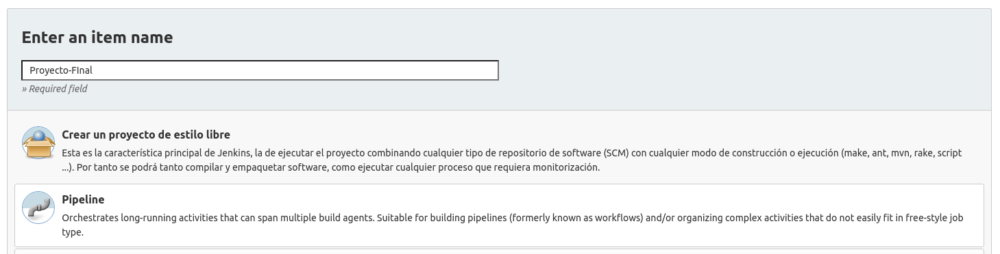 
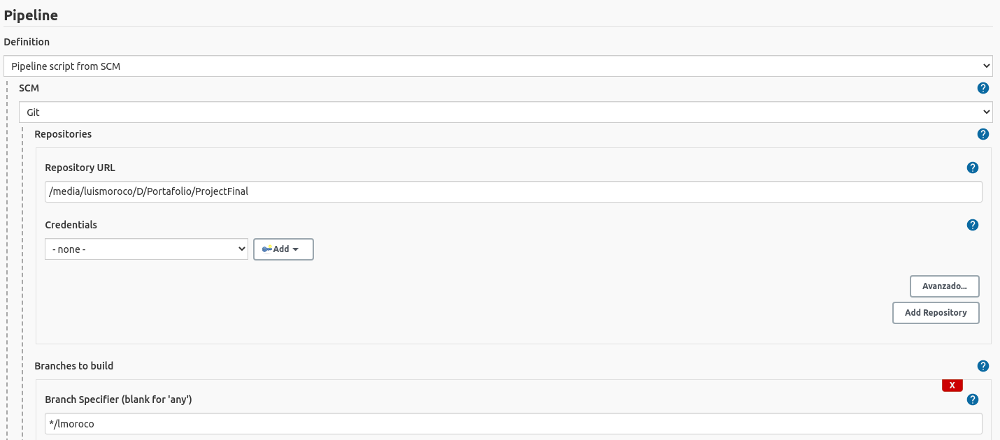 

## Ya podemos trabajar con Jenkins!
# 1. Construcción Automática

Para este proyecto, se utilizará un pipeline de Jenkins que se encargará de la construcción automática.
NodeJS falla en la construcción automática, por lo que se debe utilizar una versión de NodeJS más reciente y usar los siguientes comandos:

- Para la instalación de dependencias, se usará `npm install`
- Para la construcción, se usará `npm build`
 
 
# 2. Análisis Estático 

## Requisitos

- SonarQube official Plugin 
- SonarScanner Plugin 
- SOnar Qube Server
- sonar-project.properties

Debemos iniciar un proyecto en SonarQube, para poder realizar el análisis estático.
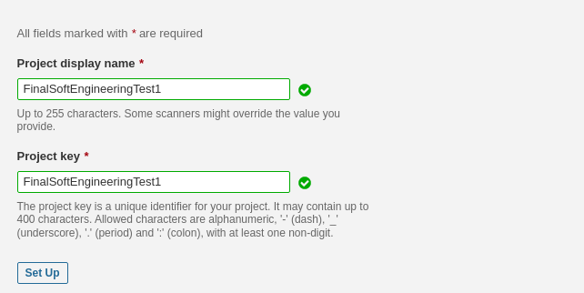 

Sonar arrojará scripts de configuración y permisos.
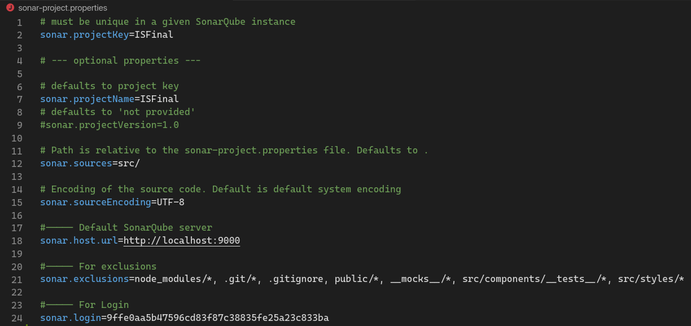 

Debemos Generar un Token:
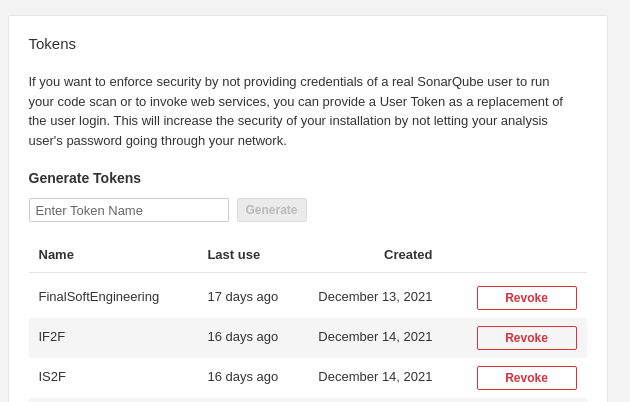 

Configuramos el servidor de Jenkins: 
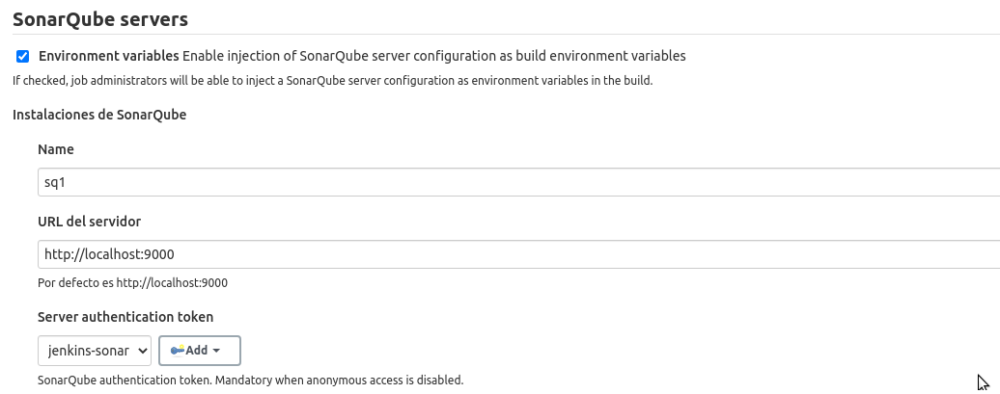

Luego el scanner:


Estamos listos para usar el plugin de SonarQube para el análisis estático! 

 
  
## Refacotoring Code

### Bad smells in code
> src/pages/index.jsx
```javascript
onKeyDown={(e) => e.onkey === '13'

// new
onKeyDown={(e) => e.key === 'Enter'
```

### Smells
> src/pages/index.jsx
```javascript
      </>
    );
  }
  return '';

// new 
      </>
    );
  }
  else {
      return ; 
  }
```

### Smells
> src/pages/index.jsx
```javascript
// no es fácil leer
return (
      <>
        {`<h1 align="center">${`${prefix} ${title}`}</h1>`}
        <br />
      </>)

// new
let x= `${prefix} ${title}`;
return (
      <>
        {`<h1 align="center">${x}</h1>`}
        <br />
      </>)
```

### Smells
> src/pages/index.jsx
```javascript

... </div>
  ) : (
    ''
  );

// new
    </div>
  ) : (
    null
  );
```

### Smells Rename
> src/components/constants/page-links.js
```javascript
// page-links.js

const links = {
  home: '/',
  about: '/about',
  addons: '/addons',
  support: '/support',
};
export default links;

// si solo exporta una clase, el doc debe llamarse igual

// links.js
```

### Smells Separate Functions
> src/components/index.jsx
```javascript
...
{copyObj.isCopied === true ? <CheckIcon size={24} /> : <CopyIcon size={24} />}

// Debemos separar la función 

const isCopied = (copyObj) => {
  return copyObj.isCopied === true ? <CheckIcon size={24} /> : <CopyIcon size={24} />;
};
```

### Smells Separate Functions
> src/components/index.jsx
```javascript
  const queryString = Object.entries(params)
    .map(([key, value]) => `${key}=${value}`)
    .join('&');
  return queryString;

  // new 

  return Object.entries(params)
    .map(([key, value]) => `${key}=${value}`)
    .join('&');

```
## Casos de prueba

<p align="center">
    
  </p>
  
# 3. Pruebas Unitarias 
En las pruebas unitarias se verifica si algunas partes del código funcionan correctamente, con estos test validamos el comportamiento de un objeto y lógica.

# 4. Pruebas de Seguridad 

## Requisitos

- Custom tool configuration
- OWASP ZAP Plugin
- URL: https://localhost:6000/

Usamos Custom Tool para configurar el plugin de OWASP ZAP:
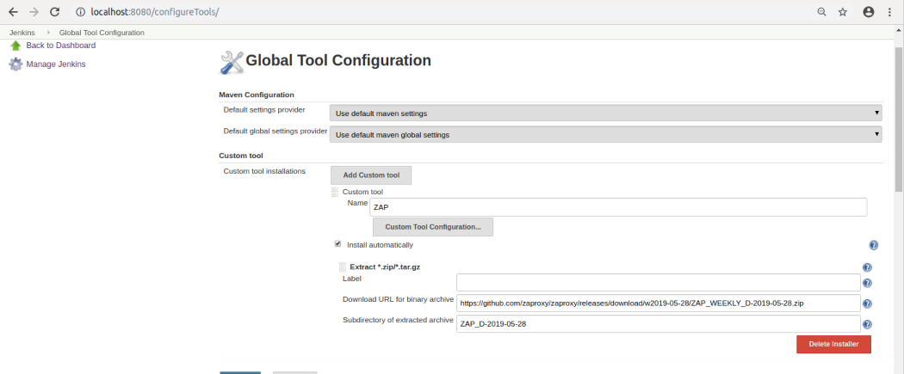

Dentro del proyecto se debe configurar el puerto:
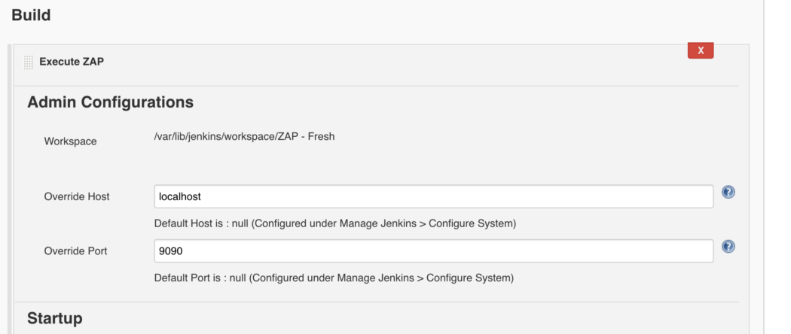

Variables de entorno y configurar la sessión de OWASP ZAP:
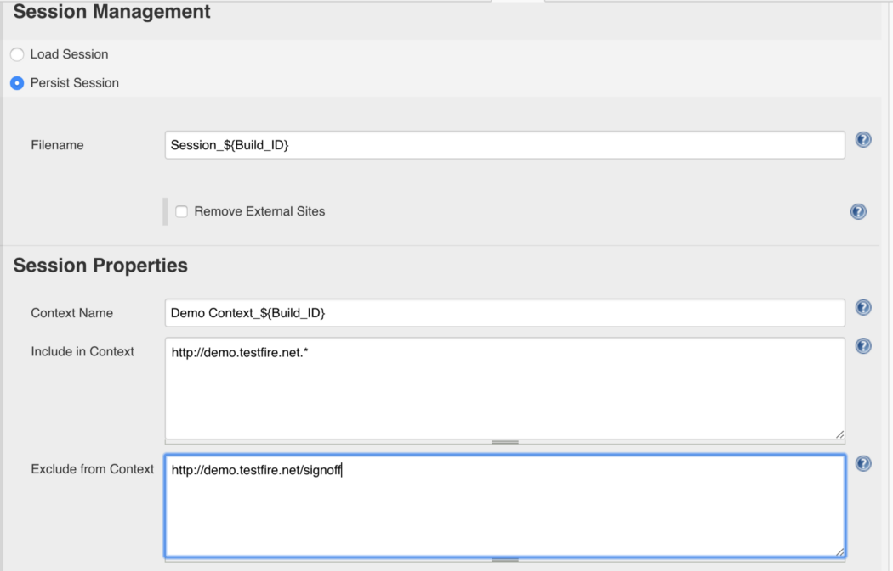

El modo de ataque:
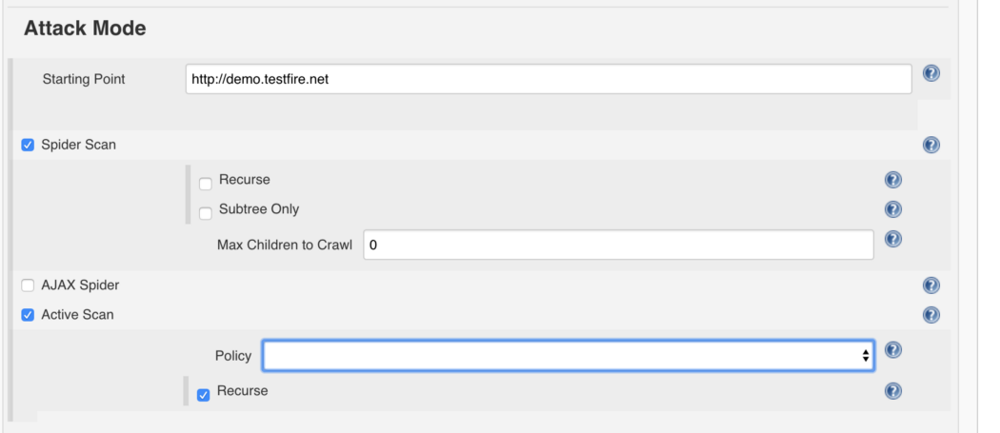

Gneramos un documento de salida con los resultados:
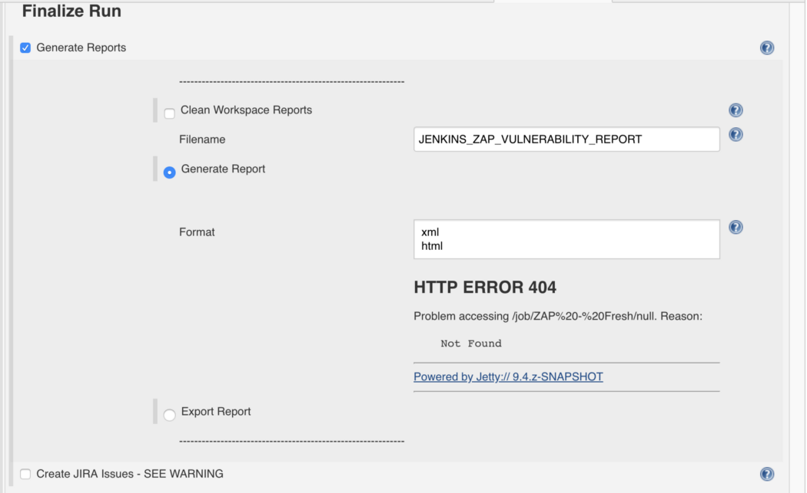

Estamos listos para usar OWASP ZAP en Jenkins!


# 5. Pruebas de Performance

## Requisitos

- Jmeter
- Consola 
- Paths (JMeter, Proyecto, Output y URL)

Usamos BlazeMeter para configurar las pruebas de performance, al finalizar se genera un documento de salida `output.jmx`, que será
cargado al proyecto y será leído por JMeter. 

Iniciamos el proyecto en JMeter y verificamos que funcione:
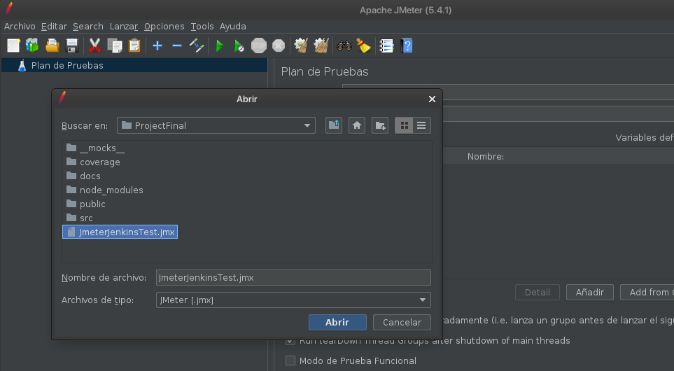


Configuramos los documentos de salida:
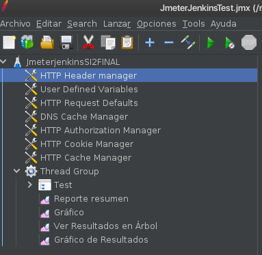


Usaremos la consola de Linux para acceder al PATH de JMeter, el proyecto y la ruta de salida: 

1. PATH JMeter:  `cd /media/<PC>/D/Clases/3ERO/IS/apache-jmeter-5.4.1/bin/`
2. Formato de salida: `-Jjmeter.save.saveservice.output_format=xml`
3. Repositorio: `/media/<PC>/D/Portafolio/ProjectFinal/JmeterJenkinsTest.jmx`
4. Ruta de salida: `/home/<PC>/Escritorio/TestJenkinsJmeter.jtl`

Debemos ejecutar los script en simultaneo, para una correcta ejecución:
Con esto podemos usar JMeter desde la consola de Jenkins!

# Gestión de Issues
Para la gestión de issues se uso la herramienta Trello debido a que todos los integrantes ya habian usado esta herramienta en anteriores proyectos.
<p align="center">
      
  </p>

# Construcción del Pipeline

## Requisitos 

- Convert to pipeline 
- Jenkinsfile
- Blue Ocean Plugin
- PerfReport

## Nota

Al iniciar un proyecto tipo pipeline, nuestras herramientas predefinidas son limitadas, así que construimos 
partes del proyecto por componentes usando proyectos `freestyle` y los convertimos a pipeline usando `Convert to pipeline`

Desde este punto, ya podemos trabajar con Jenkins!
Solo hace falta llamas a cada herramienta, plugin y variables definidas.

## Pipeline 

```yaml
pipeline {
    agent any
    environment {
            CI = 'true'
        }
    stages {
        stage('Install') {
            steps {
                sh 'yarn install'
            }
        }
        
        stage('Build') {
            steps {
                sh 'yarn build'
            }
        }

        stage('SonarQube Analysis') {

            environment{
                def SCANNER = tool name: 'SonarQubeScanner', type: 'hudson.plugins.sonar.SonarRunnerInstallation';
            }

            steps {
                withSonarQubeEnv(installationName: 'sq1' ){
                    sh "${SCANNER}/bin/sonar-scanner"
                }
            }
        }

        stage('Test') {
            steps {
                sh 'yarn test'
            }
        }

        stage('JMETER - Build') {
            steps {
                sh """
                   date
                   echo Starting the Performance Test 
                   """
                
                sh """ 
                   cd /media/luismoroco/D/Clases/3ERO/IS/apache-jmeter-5.4.1/bin/
                   sh jmeter.sh -Jjmeter.save.saveservice.output_format=csv -n -t /media/luismoroco/D/Portafolio/ProjectFinal/JmeterJenkinsTest.jmx -l /home/luismoroco/Escritorio/TestJenkinsJmeter.csv
                   """
                
                perfReport filterRegex: '', showTrendGraphs: true, sourceDataFiles: '/home/luismoroco/Escritorio/TestJenkinsJmeter.csv'
            }
        }
        
        stage('Git Checkout') {
            steps {
                sh 'git status'
                sh 'git add .'
            }
        }
    }
}
```

## Ejecución 
SonarQube:
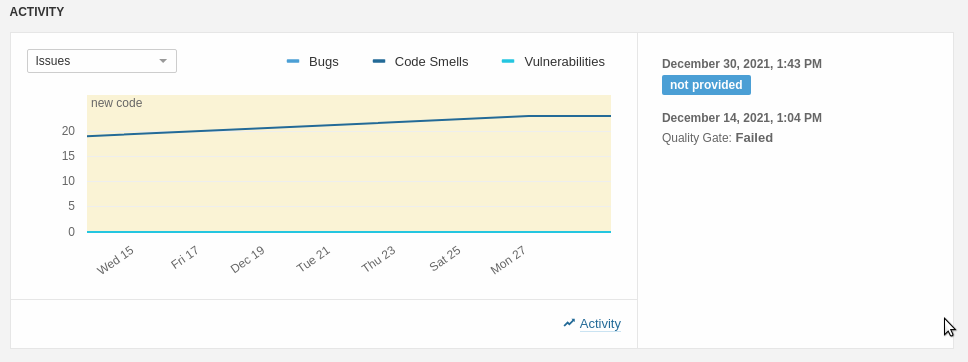

Jenkins:
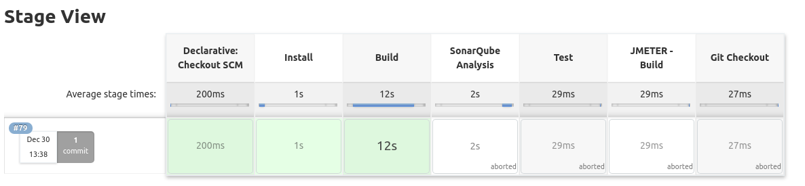

Blue Ocean:
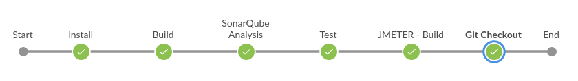

JMeter:
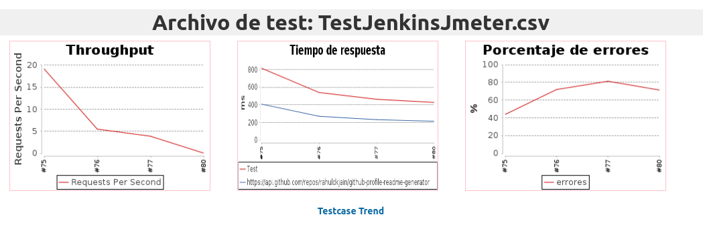

OWASP: 
<p align="center">
      
    
      
  </p>
# Happy Hacking!
